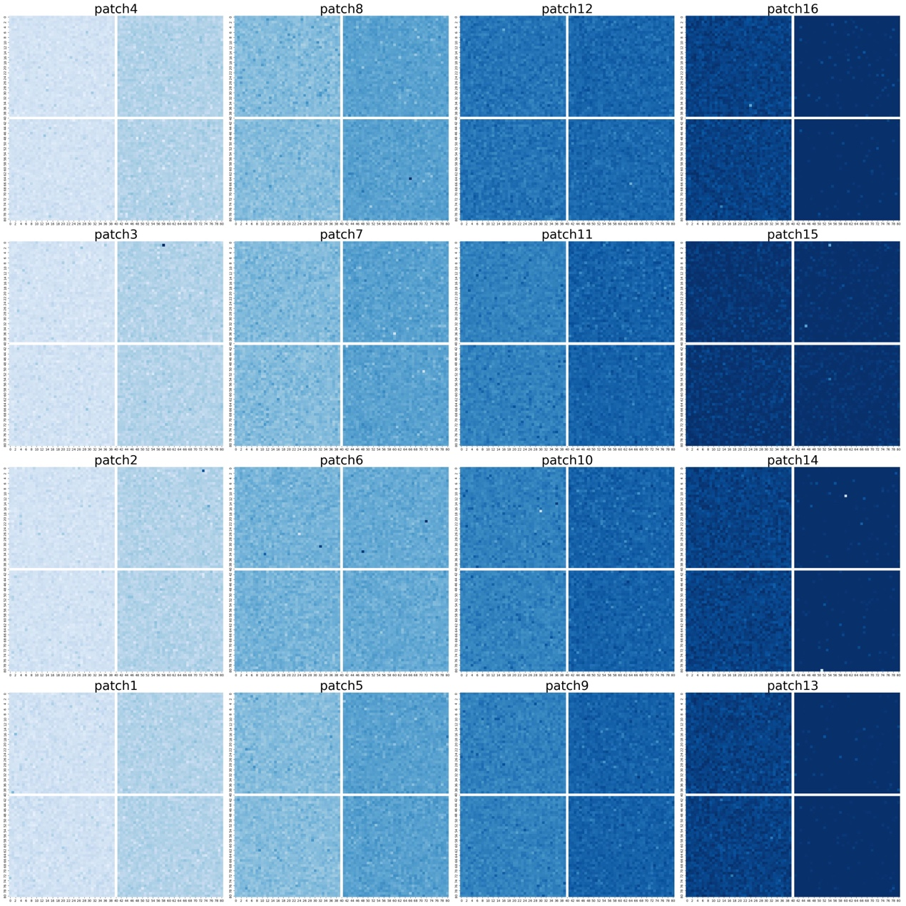
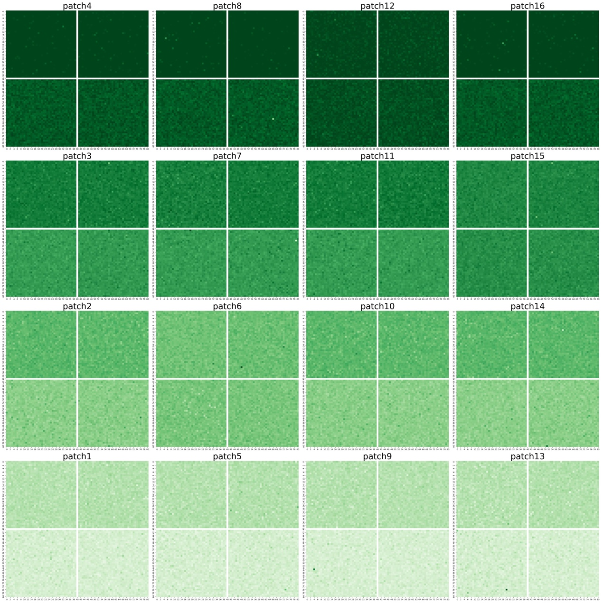
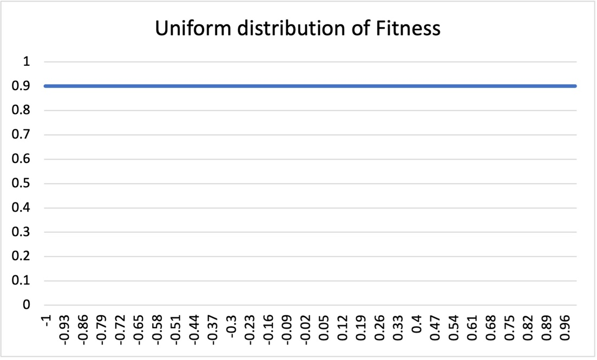
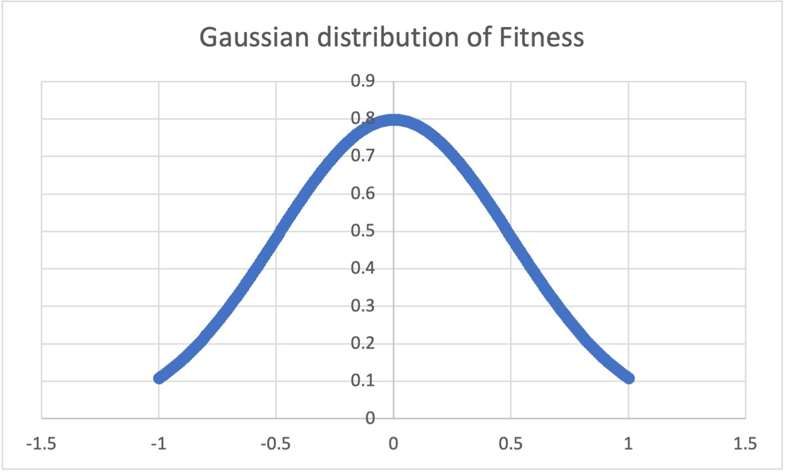
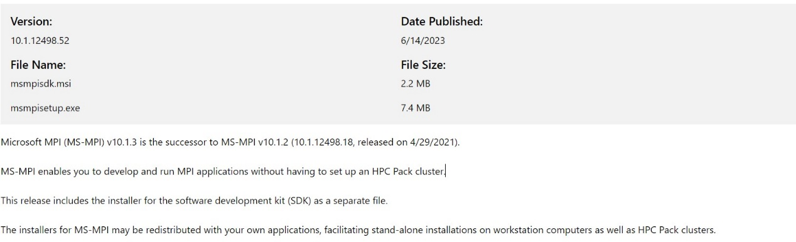

# MetaIBM Software

**USER MANUAL**

Version: 2.9.12

Authors: Jianhao Lin

## Table of contents

- [Introduction](#introduction)
- [Installation](#installation)
  - [Windows platform](#windows-platform)
  - [Linux platform](#linux-platform)
  - [MacOS platform with Apple Silicon](#macos-platform-with-apple-silicon)
  - [Importing the MetaIBM module in Python](#importing-the-metaibm-module-in-python)
- [3.Processes and sub-models](#3processes-and-sub-models)
  - [3.1 Landscape topology of a metacommunity](#31-landscape-topology-of-a-metacommunity)
    - [3.1.1 Habitat scales](#311-habitat-scales)
    - [3.1.2 patch scales](#312-patch-scales)
    - [3.1.3 global scales or metacommunity scales](#313-global-scales-or-metacommunity-scales)
  - [3.2 Species and individuals' attributes setting](#32-species-and-individuals-attributes-setting)
    - [3.2.1 Individuals and attributes](#321-individuals-and-attributes)
    - [3.2.2 the data structure of metaIBM.individual.genotype_set](#322-the-data-structure-of-metaibmindividualgenotype_set)
    - [3.2.3 the data structure of metaIBM.individual.phenotype_set](#323-the-data-structure-of-metaibmindividualphenotype_set)
  - [3.3 Environment gradients and fitness landscape](#33-environment-gradients-and-fitness-landscape)
    - [3.3.1 Environment gradients](#331-environment-gradients)
    - [3.3.2 fitness landscape](#332-fitness-landscape)
  - [3.4 Colonization process](#34-colonization-process)
    - [3.4.1 create an islands-mainland modelling system](#341-create-an-islands-mainland-modelling-system)
    - [3.4.2 modelling the Colonization process](#342-modelling-the-colonization-process)
  - [3.5 Natural selection or environmental filters process](#35-natural-selection-or-environmental-filters-process)
  - [3.6 Reproduction and mutation processes](#36-reproduction-and-mutation-processes)
    - [3.6.1 asexual reproduction](#361-asexual-reproduction)
    - [3.6.2 sexual reproduction](#362-sexual-reproduction)
    - [3.6.3 mutation](#363-mutation)
  - [3.7 Dispersal process](#37-dispersal-process)
    - [3.7.1 the dispersal of propagules](#371-the-dispersal-of-propagules)
    - [3.7.2 Dispersal among patches](#372-dispersal-among-patches)
    - [3.7.3 Dispersal within a patch](#373-dispersal-within-a-patch)
  - [3.8 Dormancy process](#38-dormancy-process)
  - [3.9 Disturbance process](#39-disturbance-process)
    - [3.9.1 Disturbance in a habitat](#391-disturbance-in-a-habitat)
    - [3.9.2 Disturbance in a patch](#392-disturbance-in-a-patch)
- [4.Input](#4input)
- [5.Output](#5output)
  - [5.1 The GUI system of the software](#51-the-gui-system-of-the-software)
    - [5.1.1 showing environmental gradients](#511-showing-environmental-gradients)
    - [5.1.2 showing species distribution](#512-showing-species-distribution)
    - [5.1.3 showing species phenotype in the metacommunity](#513-showing-species-phenotype-in-the-metacommunity)
  - [5.2 Other form of output](#52-other-form-of-output)
    - [5.2.1 saving species distribution data into a csv file](#521-saving-species-distribution-data-into-a-csv-file)
    - [5.2.2 saving species phenotypes data into a csv file](#522-saving-species-phenotypes-data-into-a-csv-file)
- [6.Examples of simulation](#6examples-of-simulation)
- [7.High performance computing (HPC)](#7high-performance-computing-hpc)
  - [7.1 Installation of MPI software and mpi4py python module](#71-installation-of-mpi-software-and-mpi4py-python-module)
    - [7.1.1 Windows platform](#711-windows-platform)
    - [7.1.2 Linux platform](#712-linux-platform)
    - [7.1.3 MacOS platform with Apple Silicon](#713-macos-platform-with-apple-silicon)
  - [7.2 Examples of parallel-computing](#72-examples-of-parallel-computing)
- [8.References](#8references)
- [9.Acknowledgements](#9acknowledgements)

## Introduction

The goal of this user manual is to explain the technical details of the software and is to give a guide of how to use the software. 

The **MetaIBM** software is released as a python-based module to simulate the metacommunity dynamics over time using agents-based modelling or individuals-based modelling. In all, the software can address a set of questions ranging from local scales to regional scales or from ecology to evolution. According to the specific studying objects of the users, a flexible modelling situation can be created by the users via setting the parameters or controlling the primitive modelling processes provided by the software. For now, the software mainly focusses on the simulation in the field of theoretical ecology and more complex and realistic agent-based models can be developed in the future versions of the software. 

Throughout this user manual, we will fist explain the primitive functions of the software and then a number of examples of simulations will be discussed. 

## Installation

In brief, we will install dependence software or python libraries including Anaconda or Miniconda, numpy, matplotlib, pandas and seaborn modules. Additionally, open-mpi software and mpi4py python modules are prerequisite if high performance computing (HPC) is available for parallel simulations and we will explain HPC in Section 7. 

Users can see the details of how to install anaconda belows,


### Windows platform

First, users should download and install Anaconda.

 

Then, users should also install python modules including numpy, matplotlib, pandas and seaborn in the command line as follow,

```bash
conda install numpy
conda install matplotlib
conda install pandas
conda install seaborn
```

### Linux platform

First, users should download and install Anaconda. 


Then, users should install the anaconda in the command line as follow,

```bash
bash Anaconda3-2023.09-0-Linux- x86_64.sh
```

Next, users should set the environment variable in the command line as follow,

```bash
vim ~/.bashrc
```

```bash
export PATH=/home/xxx/anaconda3/bin:$PATH
```

where, xxx is the user’s name of your computer login account.

Quit the vim and then,

```bash
source ~/.bashrc
```

Then, users should also install python modules including numpy, matplotlib, pandas and seaborn in the command line as follow,

```bash
conda install numpy
conda install matplotlib
conda install pandas
conda install seaborn
```

Then, users should also install python modules including numpy, matplotlib, pandas and seaborn in the command line as follow,

```bash
conda install numpy
conda install matplotlib
conda install pandas
conda install seaborn
```

### MacOS platform with Apple Silicon

First, users should download and install Anaconda.


### Importing the MetaIBM module in Python

MetaIBM is a python-based library, users can use the library by simply importing the metacommunity_IBM.py script in the same folder as below, 

```python
import metacommunity_IBM as metaIBM
```

## 3.Processes and sub-models

### 3.1 Landscape topology of a metacommunity

The software can create a metacommunity including 3 spatial scales: habitats, patches and the global metacommunity. 

#### 3.1.1 Habitat scales

Habitat is the local scales of the modelling system. In this grid-based model (Fig.1), a habitat is constituted of a set of grids (microsites). Preemptive competition is assumed that a microsite can and only can be occupied by one individual. A number of parameters can control the attributes of a habitat created by users.


*Fig.1 grid-based model of habitats*

We can create an empty habitat by calling the *class* habitat() primitively defined in the MetaIBM library as below, 

```python
metaIBM.habitat(hab_name, hab_index, hab_location, num_env_types, env_types_name, mean_env_ls, var_env_ls, length, width, dormancy_pool_max_size=0)
```

**Returns** a habitat object with a set of unoccupied microsites.

**Parameters:**

```
hab_name: string
	give a name to the habitat we intend to create.
hab_index: int
give an index of the habitat we intend to create. The index is used for distinguishing which the habitat is in a patch.
hab_location: tuple
	give a tuple with 2 elements, denoted as (X, Y) coordinates location in the landscape.
num_env_types: int
	number of environmental factors we consider in the modelling. Note that the number of environmental factors is unlimited.
env_types_name: list
	a list of the name of environmental factors
mean_env_ls: list
	a list of the mean values of environmental values of each environmental factors. For an environmental factor, the mean value of it in a habitat is equal to the mean of the micro-environmental values among all the microsites in that habitat.
var_env_ls: list
	a list of variances of micro-environmental values of each environmental factors among all the microsites in that habitat. Note that the micro-environmental values in the microsite in the habitat obey Gaussian distribution with mean and variance set by users here.
length: int
	the length of the habitat
width: int
	the width of the habitat
dormancy_pool_max_size: int, optional (default 0)
	the maximum capacity of the dormancy pool, i.e., the numbers of resting propagules that the dormancy pool in that habitat can hold. Note that when dormancy process is out of consideration, users can simply set dormancy_pool_max_size = 0, or omit the argument entirely since it defaults to 0.
```

**Examples:**

If we want to create an unoccupied habitat with the attributes as follow: 

1) the name of the habitat is ‘h1’;

2) the index of the habitat is 0;

3) the (X, Y) coordinates location of the habitat is (1,1)

4) the environmental factors we consider in the simulation are ‘temperature’ and ‘altitude’, so the number of environmental factors is two;

5) the mean temperature among microsites of the habitat is 25 degrees centigrade; the mean altitude among microsites of the habitat is 500m;

6) the temperature values of the microsites in the habitat obey a Gaussian distribution with the mean of 25 degrees centigrade and with the variance of 2.5; the altitude values of the microsites in the habitat obey a Gaussian distribution with the mean of 500m and with the variance of 50.

7) the length of the habitat is 10 and the width of the habitat is 10, so there exits totally 100 grids in the habitat.

8) the dormancy process is out of consideration, so the capacity of the dormancy pool is 0;

then, we can create the habitat by calling the following function below:

```python
habitat_object = metaIBM.habitat(hab_name='h1', hab_index=0, hab_location=(1,1), num_env_types=2, env_types_name=['temperature', 'altitude'], mean_env_ls=[25,500], var_env_ls=[2.5,50], length=10, width=10, dormancy_pool_max_size=0)
```

Then a habitat object is created. The micro-environmental values would influence the fitness of the individual in a microsite. For each environmental factors (e.g., temperature and altitude), their values may be of different order of magnitude. To control the equal contribution of each environmental factors to the individuals’ fitness, **normalized environmental values are recommended to conduct**, i.e., by setting the values ranging from 0 to 1, as below:

```python
habitat_object = metaIBM.habitat(hab_name='h1', hab_index=0, hab_location=(1,1), num_env_types=2, env_types_name=['normalized_temperature', 'normalized_altitude'], mean_env_ls=[0.6, 0.8], var_env_ls=[0.25, 0.25], length=10, width=10, dormancy_pool_max_size=0)
```

#### 3.1.2 patch scales

Patches are of the medium spatial scales in the modelling system that can be provided by the software. Within a patch, there may exist a set of habitats with various environment (i.e., environmental heterogeneity among habitats with a patch). In the software, we can fist create an empty patch by calling *class* patch() primitively defined in the MetaIBM library as below, 

```python
metaIBM.patch(patch_name, patch_index, location)
```

**Returns** a patch object without any habitat it (an empty patch).

**Parameters:**

```
patch_name: string
	give a name to the patch we intend to create.
patch_index: int
give an index of the patch we intend to create. The index is used for distinguishing which the patch is in the meta-community.
patch_location: tuple
	give a tuple with 2 elements, denoted as (X, Y) coordinates location in the landscape.
```

Then, you can add a habitat into the patch by calling the method *def* add_habitat() defined in *class* patch() as follow:

```python
metaIBM.patch.add_habitat(hab_name, hab_index, hab_location, num_env_types, env_types_name, mean_env_ls, var_env_ls, length, width, dormancy_pool_max_size=0)
```

**The parameters** is the same as *class* habitat() in Section 3.1.1.

**Examples:**

If we want to create an unoccupied patch with the attributes as below,

a patch with 4 environmentally different habitats

the (X, Y) coordinates location of the habitat is (1,1)

the environmental factors we consider are normalized temperature and normalized altitude

the normalized temperature and normalized altitude values of habitat0 is 0.2, 0.2; 

the normalized temperature and normalized altitude values of habitat1 is 0.4, 0.4; 

the normalized temperature and normalized altitude values of habitat2 is 0.6, 0.6; 

the normalized temperature and normalized altitude values of habitat3 is 0.8, 0.8.

each habitat is of 100 grids

then, we can create the patch by calling the following function below:

```python
patch_object = metaIBM.patch(patch_name='patch0', patch_index=0, location=(0.5,0.5))

patch_object.add_habitat(hab_name='h0', hab_index=0, hab_location=(0,0), num_env_types=2, env_types_name=['normalized_temperature', 'normalized_altitude'], mean_env_ls=[0.2, 0.2], var_env_ls=[0.25, 0.25], length=10, width=10, dormancy_pool_max_size=0)

patch_object.add_habitat(hab_name='h1', hab_index=1, hab_location=(0,1), num_env_types=2, env_types_name=['normalized_temperature', 'normalized_altitude'], mean_env_ls=[0.4, 0.4], var_env_ls=[0.25, 0.25], length=10, width=10, dormancy_pool_max_size=0)

patch_object.add_habitat(hab_name='h2', hab_index=2, hab_location=(1,0), num_env_types=2, env_types_name=['normalized_temperature', 'normalized_altitude'], mean_env_ls=[0.6, 0.6], var_env_ls=[0.25, 0.25], length=10, width=10, dormancy_pool_max_size=0)

patch_object.add_habitat(hab_name='h3', hab_index=3, hab_location=(1,1), num_env_types=2, env_types_name=['normalized_temperature', 'normalized_altitude'], mean_env_ls=[0.8, 0.8], var_env_ls=[0.25, 0.25], length=10, width=10, dormancy_pool_max_size=0)
```

or, we can add more habitats using for loop. We also recommend to set the *hab_index* of the habitats in a patch ranging from 0 in a row.

#### 3.1.3 global scales or metacommunity scales

Metacommunity is the global spatial scales in the modelling system that can be provided by the software. For a metacommunity, there may exists a number of patches and there may exist serval habitat in a patch. In the software, we can fist create an empty patch by calling *class* metacommunity() primitively defined in the MetaIBM library as below,

```python
metaIBM.metacommunity(metacommunity_name)
```

**Returns** a metacommunity object

**Parameters:**

```
metacommunity_name: string
	give a name to the metacommunity we intend to create.
```

**Examples:**

If we want to create an unoccupied metacommunity with 4 patches and each patches contain 4 habitats. The parameters including *patch_name*, *patch_location*, *hab_name* and *hab_location* are showed in the following figures (Fig.2).


*Fig.2 unoccupied metacommunity with environmental gradients*

Then, we can create the metacommunity by calling the following function below:

```python
patch_num = 4
patch_location_ls = [(0.5,0.5),(0.5,2.5),
				(2.5,0.5),(2.5,2.5)]
hab_num_in_a_patch = 4
hab_location_ls = [(0,0),(0,1),(1,0),(1,1),
			    (0,2),(0,3),(1,2),(1,3),
			    (2,0),(2,1),(3,0),(3,1),
			    (2,2),(2,3),(3,2),(3,3)]
hab_environment_gradient_ls = [(0.2,0.2),(0.2,0.4),(0.4,0.2),(0.4,0.4),
						 (0.2,0.6),(0.2,0.8),(0.4,0.6),(0.4,0.8),
						 (0.6,0.2),(0.6,0.4),(0.8,0.2),(0.8,0.4),
						 (0.6,0.6),(0.6,0.8),(0.8,0.6),(0.8,0.8)]
meta_object = metaIBM.metacommunity(metacommunity_name='metacommunity')
for i in range(patch_num):
    patch_object = patch(patch_name='patch%d'%(i+1), patch_index=i, location=patch_location_ls[i])
    for j in range(hab_num_in_a_patch):
        hab_location = hab_location_ls[4*i+j]
        mean_env_ls = hab_environment_gradient_ls[4*i+j]
        patch_object.add_habitat(hab_name='p%d_h%d'%(i+1,j+1), hab_index=j, hab_location= hab_location, num_env_types=2, env_types_name=['normalized_temperature', 'normalized_altitude'], mean_env_ls=mean_env_ls, var_env_ls=[0.25,0.25], length=5, width=5, dormancy_pool_max_size=0)
    meta_object.add_patch(patch_name='patch%d'%(i+1), patch_object=patch_object)
```

Then we create an unoccupied metacommunity with environmental gradients as a *meta_object*.

Finally, we also note that the three spatial scales are chosen flexibly by users according to their study objects. In other words, for example, users can set only one patch in a metacommunity to study only local dynamics or set only one habitat in a patch to set the modelling systems with only two spatial scales.

### 3.2 Species and individuals’ attributes setting

#### 3.2.1 Individuals and attributes

Individual (or agent) is the upmost fundamental unit in the study of individual-based modelling (or agent-based modelling). Individual-based model can take into consideration of more complexity of individuals-level interaction in the natural world. Each individual in a population owns its unique attributes including *species identifier*, *gender*, *age*, *phenotypes (traits values)*, and *genotypes*. Users may set an unlimited number of traits of an individual they interested in (e.g., optimum temperature, optimum humidity etc.). For each trait of an individual, we assume *L* bi-allelic additive genes coded as 1s and 0s as genotype and the phenotype is genetically based, calculated as the mean of the genotype plus a stochastic Gaussian variable indicating a non-genetic phenotypic variation. In the software, we defined an individual by calling *class* individual(), the details of which are as follow:

```python
metaIBM.individual(species_id, traits_num, pheno_names_ls, gender='female', genotype_set=None, phenotype_set=None)
```

**Returns** a specific individual object

**Parameters:**

```
species_id: string
	species identifier of the individual we intend to create. It is used to distinguish which species the individual is.
Traits_num: int
	number of traits of an individual we consider in the modelling. Note that the number of traits of an individual is unlimited, but Traits_num should be equal to num_env_types, the parameters in class habitat() and see the details in Section 3.1.1.
pheno_names_ls: list
	a list of traits name (or phenotype name) of an individual. Note that in the software, we define that traits values and phenotypes are of the same concept and traits name and phenotype name are of the same concept. See examples in this Section for further understanding.
genotype_set: dictionary
	a dictionary of genotypes with keys of traits name (or phenotype name) and values of genotypes. Understanding it in the way of Python, we would explain it as below,
	genotype_set = {‘phenotype name’: genotype},
	where genotype is two vectors coded as 0s or 1s indicating the bi-allelic additive genes of the trait name (or phenotype name). See the data structure of metaIBM.individual.genotype_set in Section 3.2.2 for details.
phenotype_set: dictionary
	a dictionary of phenotypes with keys of traits name (or phenotype name) and values of traits values (or phenotypes). Understanding it in the way of Python, we would explain it as below,
	phenotype_set = {‘phenotype name’: phenotype},
	where phenotype is a float number indicating the trait values of the trait name (or phenotype name). See the data structure of metaIBM.individual.phenotype_set in Section 3.2.3 for details.
```

By default, genotype_set=*None*, phenotype_set=*None*, so then we need to initialize the individual we just created with parameters controlling its phenotypes and genotypes by calling the method as follow,

```python
metaIBM.individual.random_init_indi(mean_pheno_val_ls, pheno_var_ls, geno_len_ls)
```

the attribute of the individual object calling this method will be modified.

**Returns** None

**Parameters:**

```
mean_pheno_val_ls: list
	a list of phenotypes (trait values) of each trait. 
pheno_var_ls: list
	a list of variances of phenotypes (trait values) indicating the non-genetic influence on the phenotypes (trait values)
geno_len_ls: list
	a list of the length of each genotype, i.e., the length of the vectors representing the genotype. See Section 3.2.2 for details.
```

**Examples:**

If we want to create an individual with the attributes as follow, 

it is an individual of a species (For examples, the species name is ‘sp1’)

in the modelling, two traits of the individual matter. (For examples, the traits names are ‘optimum temperature’, ‘optimum attitude’.) Optimum temperature of an individual is defined as the temperature values at which the individual could survive with highest fitness. Optimum attitude of an individual is defined as the attitudes values at which the individual could survive with highest fitness.

the ‘optimum temperature’ value and ‘optimum attitude’ value of the individual are set in a normalization way (i.e., ‘normalized optimum temperature’ and ‘normalized optimum attitude’). For example, the ‘normalized optimum temperature’ is 0.6 and the ‘normalized optimum attitude’ is 0.8. 

the traits (‘optimum temperature’ and ‘optimum attitude’) of an individual is genetic-based. The genotypes of an individual are a vector with *length=20* coded as 0s or 1s indicating the bi-allelic additive genes, so that the mean values of the vector are equal to the trait values we set. The details are as follow,

the ‘normalized optimum temperature’ value is 0.6.

randomly initializing the bi-allelic genotype controlling ‘normalized optimum temperature’ denoted as a pair of vectors (or we can define it as **genotype1**) is, 

```python
[1, 0, 0, 1, 0, 1, 0, …, 1, 0, 0] length=20
[0, 1, 0, 1, 0, 0, 1, …, 0, 1, 0] length=20
```

, where the mean of the vector should be 0.6.

the ‘normalized optimum attitude’ is 0.8.

randomly initializing the bi-allelic genotype controlling ‘normalized optimum attitude’ denoted as a pair of vectors (or we can define it as **genotype2**) is, 

```python
[0, 1, 0, 1, 0, 0, 1, …, 1, 0, 1] length=20
[0, 1, 1, 0, 1, 1, 0, …, 0, 1, 1] length=20
```

, where the mean of the vector should be 0.8.

the genetic-based traits values can also be influenced by a non-genetic phenotypic variation. Then, the phenotype is calculated as the mean of the genotype plus a stochastic Gaussian variable indicating a non-genetic phenotypic variation. If we defined that ‘normalized optimum temperature’ is **Phenotype1** and ‘normalized optimum attitude’ is **Phenotype2**, then,

```python
phenotype1 = mean(genotype1) + G = 0.6 + N(0, 0.25)
phenotype2 = mean(genotype2) + G = 0.8 + N(0, 0.25)
, where N is denoted as a stochastic Gaussian variable with mean=0, variance=0.25. 
```

The individual we create is female.

Then, we can create a specific individual object by calling the following function:

```python
individual_object = metaIBM.individual(species_id='sp1', traits_num=2, pheno_names_ls=['normalized_optimum_temperature','normalized_optimum_attitude'], gender='female')
```

We create an individual object first.

```python
individual_object.random_init_indi(mean_pheno_val_ls=[0.6,0.8], pheno_var_ls =[0.25,0.25], geno_len_ls=[20,20])
```

After that, we initialize the attributes of the individual object.

#### 3.2.2 the data structure of metaIBM.individual.genotype_set

When using the software, users do not need to know the data structure of metaIBM.individual.genotype_set very well. However, for a better understanding we try to explain the data structure of it. metaIBM.individual.genotype_set is a dictionary, the keys of it is the traits names input in pheno_names_ls (the parameters of metaIBM.individual()) and the values of the dictionary are a pair of vectors with the length of 20 (a two dimension list). 

Take the example in Section 3.2.1, metaIBM.individual.genotype_set= {'normalized_optimum_temperature' : genotype1, 'normalized_optimum_attitude' : genotype2} and the data structure of genotype1 and genotype2 are as follow, genotype1 = [[1,0,1,1,0,1,0,1,0,1,0,1,0,1,0,1,1,0,1,1],[0,1,0,1,0,1,1,0,1,1,0,1,1,0,1,0,1,1,0,1]]

```python
Genotype2 = [np.array([1,1,1,0,1,1,1,1,0,1,1,1,0,1,1,1,1,0,1,1]),
						 np.array([1,1,1,0,1,1,1,1,1,0,1,1,1,1,1,0,1,1,0,1])]
```

In this example, the genotype1 is randomly initialized with twelve 1s and eight 0s in the vector so that the mean of the vector is 0.6 and genotype2 is randomly initialized with sixteen 1s and four 0s in the vector so that the mean of the vector is 0.8. 

#### 3.2.3 the data structure of metaIBM.individual.phenotype_set

When using the software, users do not need to know the data structure of metaIBM.individual.phenotype_set very well. However, for a better understanding we try to explain the data structure of it. metaIBM.individual.phenotype_set is a dictionary, the keys of it is the traits names input in pheno_names_ls (the parameters of metaIBM.individual()) and the values of the dictionary are the traits values (phenotype) which is a float. 

Take the example in Section 3.2.1, metaIBM.individual.phenotype_set= {'normalized_optimum_temperature':0.612, 'normalized_optimum_attitude':0.7988}.

In this example, phenotype is equal to the mean of genotype plus a stochastic Gaussian variable with mean=0, variance=0.25. 

### 3.3 Environment gradients and fitness landscape

#### 3.3.1 Environment gradients

In the Section 3.1 we have talked about the spatial scales and the topology of the metacommunity landscape and the environmental values setting of each habitat which is continued of grids. In each grid, the number of environmental factors can be unlimited set by the users. In this part, we are going to talk about the relationship between phenotypes of an individual and the environmental values in a grid in the landscape, which contribute to the fitness landscape of the individual of a species.

Environmental gradients can be created in the modelling system, since the users can easily create habitats or patches with their unique X-Y coordinates and environmental values. Take an example as follow, 

**Examples:**

If we want to create a metacommunity is made up of 16 patches and each patch contains 4 habitats with 10000 grides. The environmental factors we are interested in are 'x_axis_environment' and 'y_axis_environment' (whatever the name is, just give a name to the environmental factor in the example). The environmental values are normalized ranging from 0 to 1 (see the example in Section 3.1.1 for details). In the X-Y coordinate system of the metacommunity landscape, the values of 'x_axis_environment' are of gradient along X-axis ranging from 0 to 1 (Fig.3a) and the values of 'y_axis_environment' are of gradient along Y-axis ranging from 0 to 1(Fig.3b).



*Fig.3a the environmental gradient of x_axis_environment along X-axis*



*Fig.3b the environmental gradient of y_axis_environment along Y-axis*

Then, we can create the metacommunity in the modelling system by calling the following function below:

```python
patch_num = 16
patch_num_x_axis, patch_num_y_axis = 4, 4
hab_num_x_axis_in_a_patch, hab_num_y_axis_in_a_patch = 2, 2
x_axis_environment_values_range, y_axis_environment_values_range = [0.1, 0.9], [0.1, 0.9]
patch_location_ls = [(i,j) for i in range(0,4) for j in range(0,4)]
```

```python
meta_object = metacommunity(metacommunity_name=meta_name)
for i in range(0, patch_num):
    patch_name = 'patch%d'%(i+1)
    patch_index = i
    location = patch_location_ls[i]
    patch_obj = patch(patch_name, patch_index, location)
    patch_x_loc, patch_y_loc = location[0], location[1] 
    for j in range(hab_num):
        habitat_name = 'h%s'%str(j+1)
        hab_index = j

        hab_x_loc = patch_x_loc*hab_num_x_axis_in_a_patch+j//hab_num_y_axis_in_a_patch
hab_y_loc = patch_y_loc*hab_num_y_axis_in_a_patch+j%hab_num_y_axis_in_a_patch
        hab_location = (hab_x_loc, hab_y_loc)

        x_axis_min = x_axis_environment_values_range[0]
x_axis_max = x_axis_environment_values_range[1]
        y_axis_min = y_axis_environment_values_range[0]
y_axis_max = y_axis_environment_values_range[1]
        x_step = (x_axis_max - x_axis_min)/(patch_num_x_axis*hab_num_x_axis_in_a_patch)
        y_step = (y_axis_max - y_axis_min)/(patch_num_y_axis*hab_num_y_axis_in_a_patch)
        x_axis_environment_means_value = x_axis_min+1/2*x_step + x_step*hab_x_loc
        y_axis_environment_means_value = y_axis_min+1/2*y_step + y_step*hab_y_loc
                
        patch_obj.add_habitat(hab_name=habitat_name, hab_index=hab_index, hab_location= hab_location, num_env_types=2, env_types_name=['x_axis_environment', 'y_axis_environment'], mean_env_ls=[x_axis_environment_means_value, y_axis_environment_means_value], var_env_ls= [0.25,0.25], length=100, width=100, dormancy_pool_max_size=0)

    meta_object.add_patch(patch_name=patch_name, patch_object=patch_obj)
```

Then, we create the metacommunity as meta_object.

#### 3.3.2 fitness landscape

First of all, we have to defined what is fitness of an individual of a species. In the software, we defined the fitness as the survival rate of an individual in a grid. The survival rate function is defined in metaIBM.habitat.survival_rate(). For now, two options of the survival rate can be chosen and we assumed that the survival rate of an individual obeys a Uniform distribution or a Gaussian distribution. 

For a Uniform distribution of fitness, neutral model (Hubbell 2001) is assumed that the survival rate of an individual is always a constant in the regardless of the phenotypes of the individual and the micro-environmental values of the grid the individual is located in. For examples, 

```python
Survival_rate = d
```

, where d is a baseline death rate which is a constant (Fig.4a).

For a Gaussian distribution of fitness, **niche model** is assumed that when the traits values of an individual meet the micro-environmental values of the grid very well, the individual can live with the highest survival rate. Take the normalized temperature as the micro-environment in grides and the normalized optimum temperature as the trait of an individual for an example, 

, where *S_i* is the survival rate of individual ***i***; *d* is the baseline dead rate; *z_i* is the phenotype (normalized optimum temperature value) of individual ***i***; *e* is the micro-environmental values (normalized temperature value) of the grid or microsite; *σ* is the width of selection (Fig.4b). Similarly, when more environmental factors and more traits are taken into consideration, multivariate Gaussian Distribution is assumed.



*Fig.4a Uniform distribution of fitness*



*Fig.4b Gaussian distribution of fitness*

### 3.4 Colonization process

#### 3.4.1 create an islands-mainland modelling system

In the previous Section, we have discussed about how to create an unoccupied metacommunity. In this part, we will talk about how to create a pre-occupied mainland as a species pool and how the propagules in species pool disperse from the pre-occupied mainland to the unoccupied metacommunity by calling the colonization process in the software. 

In the initialization of the pre-occupied mainland, we assumed that at the start of simulations, the species in the mainland are of equilibrium state and they are adapted to the environment in the mainland very well. Mainland is also a metacommunity object by setting only one patch. To do so, we need to create an unoccupied mainland first and then initialize the individuals of each species in the mainland by calling the primitive methods (metaIBM.metacommunity() and metaIBM.meta_initialize()) in the software. See Section 3.1.3 for details of metaIBM.metacommunity(). We can initialize the individual of each species in the mainland by calling the metaIBM.meta_initialize() function, as follow, 

```python
metaIBM.meta_initialize(traits_num, pheno_names_ls, pheno_var_ls, geno_len_ls, reproduce_mode, species_2_phenotype_ls)
```

**Returns** Strings, information about the initialization of individuals

**Parameters:**

```
traits_num: int
	the number of traits of the individuals to be initialized we take into consideration in the modelling system.
pheno_names_ls: list
	a list of traits name (or phenotype name) of an individual. Note that in the software, we define that traits values and phenotypes are of the same concept and traits name and phenotype name are of the same concept. See examples in this Section 3.2.1 for further understanding.  
pheno_var_ls: list
	a list of variances of phenotypes (trait values) indicating the non-genetic influence on the phenotypes (trait values)
geno_len_ls: list
	a list of the length of each genotype, i.e., the length of the vectors representing the genotype. See Section 3.2.2 for details.
reproduce_mode: string
	‘asexual’ (asexual reproduction mode) or ‘sexual’ (sexual reproduction mode). In the initialization, all the individuals are female when we are modelling in the asexual reproduction mode and half of the individuals are female or male in the sexual reproduction mode. The setting here can affect the reproduction process in Section 3.6. 
species_2_phenotype_ls: list
	a list of phenotypes informattion of each species. See example below for better understanding. 
```

***Future Warning*** that we will (may) use a ***dictionary*** data structure instead of ***list*** as the parameter for inputting the species information in the future version of the software and then the order of elements will (may) not matters in the future. But for now, the **Future Warning** does not matter.

**Examples:**

If we want to create a pre-occupied mainland and an unoccupied metacommunity, just as the islands-mainland model for example, at the start of the simulation. In the modelling system, two environmental factors are taken into consideration: ***normalized temperature (NT.)*** and ***normalized altitude (NA.)*** and two traits of a species are taken into consideration: ***normalized optimum temperature (NOT.)*** and the ***normalized optimum altitude (NOA.)***. 

The mainland is constituted of only 1 patch and the patch is consist of 16 habitats with 10000 grids. The attributes of the mainland are as follow,

The X-Y coordinates and the environmental values of the habitats in the mainland are tabled below,

| habitat name | h4 | h8 | h12 | h16 |
|---|---|---|---|---|
| X-Y | (0,3) | (1,3) | (2,3) | (3,3) |
| environmental values (NT, NA) | (0.8,0.2) | (0.8,0.4) | (0.8,0.6) | (0.8,0.8) |
| habitat name | h3 | h7 | h11 | h15 |
| X-Y | (0,2) | (1,2) | (2,2) | (3,2) |
| environmental values (NT, NA) | (0.6,0.2) | (0.6,0.4) | (0.6,0.6) | (0.6,0.8) |
| habitat name | h2 | h6 | h10 | h14 |
| X-Y | (0,1) | (1,1) | (2,1) | (3,1) |
| environmental values (NT, NA) | (0.4,0.2) | (0.4,0.4) | (0.4,0.6) | (0.4,0.8) |
| habitat name | h1 | h5 | h9 | h13 |
| X-Y | (0,0) | (1,0) | (2,0) | (3,0) |
| environmental values (NT, NA) | (0.2,0.2) | (0.2,0.4) | (0.2,0.6) | (0.2,0.8) |

There exist 16 species in the mainland as species pool and the attributes of the species are tabled below, 

| species name | sp4 | sp8 | sp12 | sp16 |
|---|---|---|---|---|
| traits values (NOT, NOA) | (0.8,0.2) | (0.8,0.4) | (0.8,0.6) | (0.8,0.8) |
| species name | sp3 | sp7 | sp11 | sp15 |
| traits values (NOT, NOA) | (0.6,0.2) | (0.6,0.4) | (0.6,0.6) | (0.6,0.8) |
| species name | sp2 | sp6 | sp10 | sp14 |
| traits values (NOT, NOA) | (0.4,0.2) | (0.4,0.4) | (0.4,0.6) | (0.4,0.8) |
| species name | sp1 | sp5 | sp9 | sp13 |
| traits values (NOT, NOA) | (0.2,0.2) | (0.2,0.4) | (0.2,0.6) | (0.2,0.8) |

Note that species_2_phenotype_ls is the parameter for inputting the species information. In this case, species_2_phenotype_ls = [(0.2,0.2),(0.4,0.2),(0.6,0.2),(0.8,0.2),(0.2,0.4),(0.4,0.4),(0.6,0.4),(0.8,0.4),

(0.2,0.6),(0.4,0.6),(0.6,0.6),(0.8,0.6),(0.2,0.8),(0.4,0.8),(0.6,0.8),(0.8,0.8)]. We also note that the order of the elements in the list should follow the order of species name. 

***Future Warning again*** that we will use a ***dictionary*** data structure as the parameter for inputting the species information in the future version of the software and then the order of elements will (may) not matters in the future. But for now, the **Future Warning** does not matter.

We assumed that the individuals of species in the mainland are pre-adapted to the environments of the habitats in the mainland and they are of equilibrium state. To do so, when calling the initialization methods (metaIBM.meta_initialize()), for each habitat in the mainland, according to the environmental values of the habitat and the traits values of all the species, we choose the species with a highest fitness to occupy the habitat in the initialization process.

We will also create an unoccupied metacommunity with the attributes as follow, 

The environmental factors taken into consideration in the metacommunity is normalized temperature (NT.) and normalized altitude (NA.)

The environment gradients in the metacommunity are similar to the example in Section 3.3.1. 

Then we can create the islands-mainland modelling system by calling the following functions in the software as follow, 

```python
mainland = metacommunity(metacommunity_name=meta_name)
patch_object = patch(patch_name='patch0', patch_index=0, location=(0,0)) # only one patch
hab_num = 16 # there exist 16 habitats in the mainland
hab_location_ls = [(i,j) for i in range(4) for j in range(4)]
hab_environment_ls = [(0.2*j+0.2, 0.2*i+0.2) for i in range(4) for j in range(4)]

for k in range(hab_num):
    habitat_name = 'h%s'%str(k+1)
    hab_index = k
    hab_location = hab_location_ls[k]
            
    patch_object.add_habitat(hab_name=habitat_name, hab_index=hab_index, hab_location=hab_location, num_env_types=2, env_types_name=['normalized_temperature', 'normalized_altitude'], mean_env_ls=hab_environment_ls[k], var_env_ls=[0.25,0.25], length=100, width=100, dormancy_pool_max_size=0)
            
mainland.add_patch(patch_name=patch_name, patch_object=patch_object)
```

Then the pre-occupied mainland with species of equilibrium has been generated!

After that, we can generate the unoccupied metacommunity by calling the functions in the example of Section 3.3.1. 

#### 3.4.2 modelling the Colonization process 

In the sub-model of colonization process, we assumed that the species colonize the empty grids in the metacommunity from the mainland via **propagules’ rains**. In the software, we randomly pick the propagules from the mainland to the metacommunity by **sampling with replacement**. To do so, we can call the primitive functions, as follow, 

```python
metaIBM.meta_colonize_from_propagules_rains(mainland_obj, propagules_rain_num)
```

**Returns** Strings, the information of colonization process

**Parameters:**

```
mainland_obj: a mainland object
	an object we have defined as a mainland. See Section 3.4.1
propagules_rain_num: int
	the number of propagules disperse from mainland to the metacommunity by propagules’ rains.
```

Note that, when modelling in the **sexual reproduction mode**, we recommend to call the function as follow,

```python
metaIBM.pairwise_sexual_colonization_from_prpagules_rains(mainland_obj, propagules_rain_num)
```

**Returns** Strings, the information of colonization process

**Parameters:**

```
mainland_obj: a mainland object
	an object we have defined as a mainland. See Section 3.4.1
propagules_rain_num: int
	in the sexual reproduction mode, a ‘female’ and a ‘male’ are need to reproduce. Then, by calling this function, a pair of ‘female’ and ‘male’ of the same species will disperse randomly to the same habitat in the metacommunity. If propagules_rain_num=20, then 5 pairs of ‘female’ and ‘male’ of the same species will colonize the empty grids of the metacommunity.
```

**Examples:**

Following the example in Section 3.4.1, we have generated an object of the pre-occupied mainland and an object of the initially unoccupied metacommunity (i.e., meta_object and mainland). Next, we need to make ***20 propagules*** of mainland disperse and colonize the empty grids of the meta_object by random propagules’ rains. To do so in the **asexual reproduction mode**, we can call the following function,

```python
meta_obj.meta_colonize_from_propagules_rains(mainland_obj=mainland, propagules_rain_num=20)
```

However, in the **sexual reproduction mode**, we can call the following function,

```python
meta_obj. pairwise_sexual_colonization_from_prpagules_rains(mainland_obj=mainland, propagules_rain_num=20)
```

### 3.5 Natural selection or environmental filters process

In this process, some individuals will be dead following the rules bellows, (1) for all the individuals in the metacommunity, we calculated their **survival rates** and the calculation of survival rate are defined in *Section 3.2.1*; (2) then for the survival-ship of each individual, we generate a stochastic variable that obeys a **Uniform distribution** ranging from 0 to 1. (3) if the stochastic variable is less than or equal to the survival rate, then the individual is alive; otherwise, if the stochastic variable is greater than the survival rate, then the individual is dead. To do so, users can call the following function, 

```python
metaIBM.meta_dead_selection(base_dead_rate, fitness_wid, method)
```

**Returns** Strings, the information of the natural selection process

**Parameters:**

```
based_dead_rate: float
	baseline dead rate, a parameter for calculating the fitness. See Section 3.2.1.
fitness_wid: float
	the width of selection, a parameter for calculating the fitness. See Section 3.2.1.
method: string
	two options for this parameter, 'niche_gaussian' and 'neutral_uniform'. In the niche model, the fitness obeys a Gaussian distribution and in the neutral model, the fitness obeys a Uniform distribution.
```

**Examples:**

Supposing that the metacommunity object is defined as meta_object in the software (Section 3.1.3), we can simulate the natural selection process in the metacommunity by calling the function below, 

For a neutral model

```python
meta_obj.meta_dead_selection(base_dead_rate, fitness_wid, method='neutral_uniform')
```

For a niche model

```python
meta_obj.meta_dead_selection(base_dead_rate, fitness_wid, method='niche_gaussian')
```

### 3.6 Reproduction and mutation processes

#### 3.6.1 asexual reproduction

In asexual reproduction, the offspring or propagules born in this process are identical to their parents. The attributes of the propagules including *species_id**entifier*, *gender* and *genotype**s* are the same to these of their parents and the phenotypes will be recalculated as the mean of genotype plus a stochastic variable that obeys a Gaussian distribution. In the metacommunity, to conduct the asexual reproduction process, users can call the function below, 

```python
metaIBM.meta_asex_reproduce_mutate_into_offspring_pool(asexual_birth_rate, mutation_rate, pheno_var_ls)
```

Note that after conducting the function in the software, the new-born offspring (individual objects) will be put into the offspring pool in each habitat as an attribute of the habitat, metaIBM.habitat.offspring_pool which is a list of individual objects of new-born offspring. 

**Returns** strings, the information of asexual reproduction

**Parameters:**

```
asexual_birth_rate: float
	birth rate of asexual reproduction controlling the number of offspring in the process.  
mutation_rate: float
	for each gene (denoted as 0 or 1), the gene value mutates from 0 to 1, vice versa, with mutation rate. See Section 3.6.3 for details.
pheno_var_ls: list
	a list of variances used in the recalculation of phenotypes of the offsprings. 
```

**Examples:**

Supposing that the metacommunity object is defined as meta_object in the software (Section 3.1.3 or Section 3.3.1), we can simulate the asexual reproduction process with birth_rate=0.5 in the metacommunity by calling the function below,

```python
meta_obj.meta_asex_reproduce_mutate_into_offspring_pool(asexual_birth_rate=0.5, mutation_rate=0.00001, pheno_var_ls=[0.25,0.25])
```

#### 3.6.2 sexual reproduction

In the sexual reproduction, two parents of the same species reproduce an offspring individual. The **rules** are as follow,

the *species_identifier* of the offspring is the same as that of their patents

the *gender* of the offspring is ‘female’ or ‘male’ with the probability of 50% respectively. 

the *genotypes* of the offspring are inherited from their parents in a way of Mendel's laws of inheritance.

the phenotypes will be recalculated as the mean of genotype plus a stochastic variable that obeys a Gaussian distribution.

only the female and male of the same species in the same habitat can mate. 

To do so, users can call the following function,

```python
metaIBM.meta_sex_reproduce_mutate_into_offspring_pool(sexual_birth_rate, mutation_rate, pheno_var_ls)
```

Note that after conducting the function in the software, the new-born offspring (individual objects) will be put into the offspring pool in each habitat as an attribute of the habitat, metaIBM.habitat.offspring_pool which is a list of individual objects of new-born offspring. 

**Returns** strings, the information of sexual reproduction

**Parameters:**

```
sexual_birth_rate: float
	birth rate of sexual reproduction controlling the number of offspring in the process. Note that the birth rate control the reproduction of a pair of parents.
mutation_rate: float
	for each gene (denoted as 0 or 1), the gene value mutates from 0 to 1, vice versa, with mutation rate. See Section 3.6.3 for details.
pheno_var_ls: list
	a list of variances used in the recalculation of phenotypes of the offsprings. 
```

**Examples:**

Supposing that the metacommunity object is defined as meta_object in the software (Section 3.1.3 or Section 3.3.1), we can simulate the asexual reproduction process with birth_rate=1 in the metacommunity by calling the function below,

```python
meta_obj.meta_sex_reproduce_mutate_into_offspring_pool(sexual_birth_rate=1, mutation_rate=0.00001, pheno_var_ls=[0.25,0.25])
```

Note that, the sexual_birth_rate controls the birth rate of a pair of patents, the expectance of the number of offspring is the same between asexual reproduction with asexual_birth_rate=0.5 and sexual reproduction with sexual_birth_rate=1.

#### 3.6.3 mutation 

Mutation process occurs in the period of reproduction process. As the genotypes are represented by a pair of vectors. When mutation occurs, for each element in the vectors, the element mutate from 0 to 1, vice versa with mutation rate *μ*.

### 3.7 Dispersal process

#### 3.7.1 the dispersal of propagules

In the sub-model of dispersal process, we assumed that only the propagules can disperse across habitats. First, we need to calculate the number of propagules in each habitat or in each patch. For a habitat，the expectation number of offspring in the habitat is

I = 

, where *I* is the expectation number of offspring in a habitat, *b* is the parameter of birth rate,  is the number of female in the habitat. For a patch, the expectation number of offspring in the patch is

Ipatch = 

, where *I**patch* is the expectation number of offspring in a patch, *b* is the parameter of birth rate, *hab_num* is the number of habitats in the patch,  is the number of females in *habitat **i* of the patch. 

#### 3.7.2 Dispersal among patches

The process of dispersal among patches are described as a Markov stochastic process. In the metacommunity, we calculated the expectation number of offspring of each patch denoted as ***I_patch***(the subscript is the index of a patch). The number of offspring propagules in each patch throughout the metacommunity is expressed in the form of *a diagonal matrix*, denoted as **matrix I**:

*I = *

, where the element *I**ii* indicates the number of offspring propagules in the patch with the index of ***i***. 

Next, we need to calculate the distance between each two patches in the metacommunity according to the X-Y coordinates of the two patches. For patch i and patch j, supposing that their X-Y co coordinates are （xi，yi） and （xj，yj） respectively. Then the distance between patch i and patch j (denoted as *d**ij*) is calculated as follow,

ij

Then，based on the Euclidean distance of each pairwise patches in the metacommunity, we calculated the dispersal strength of each two patches defined as follow, 

Dispersal model is assumed that dispersal strength between patches decay exponentially with the increase of the distance (Leibold et al. 2018).  is the dispersal strength between patch i and patch j and *ρ** *is a scaling factor determining the strength of dispersal limitation. The larger 𝜌, the narrower the dispersal kernel. Next, we calculated the dispersal rate among patches as, 

, where  is the dispersal rate between patch i and patch j, indicating the proportion of propagules in patch i disperse to pacth j. For patch i, a proportion of propagules stay in the local patch denoted as,

In the modelling system of the metacommunity, we calculated the  and we put it into a form of matrix M as follow, 

Finally, we calculated the emigrants matrix with the elements (eij) in which indicating the number of propagules leaving from patch i to patch j as follow, 

Users can simulate the dispersal among patches process by calling the method below, 

```python
metaIBM.dispersal_aomng_patches_from_offspring_pool_to_immigrant_pool(total_disp_among_rate)
```

When we are conducting this function, the propagules disperse from metaIBM.habitat.offspring_pool of a habitat to metaIBM.habitat.immigrant_pool the other habitat.

**Returns** strings, the information of dispersal among patches process

**Parameters:**

```
total_disp_among_rate: float
	dispersal rate among patches, the proportion of propagules the proportion of propagules leaving a patch
```

**Examples:**

Supposing that the metacommunity object is defined as meta_object in the software (Section 3.1.3 or Section 3.3.1) and that reproduction process is conducted, we can simulate the dispersal among patches process with total_disp_among_rate=0.1 in the metacommunity by calling the function below,

```python
meta_obj.dispersal_aomng_patches_from_offspring_pool_to_immigrant_pool(total_disp_among_rate=0.1)
```

#### 3.7.3 Dispersal within a patch

Within a patch, we assume that each two habitats within the patch are of the same distance. Hence, for a habitat, some proportion (*m**within*) of propagules in the habitat disperse to the other patches within the patch ***evenly*** and the rest of the propagules (1-*m**within*) stay in the local habitat.

Users can simulate the dispersal among patches process by calling the method below, 

```python
metaIBM.meta_dispersal_within_patch_from_offspring_to_immigrant_pool(disp_within_rate)
```

When we are conducting this function, the propagules disperse from metaIBM.habitat.offspring_pool of a habitat to metaIBM.habitat.immigrant_pool the other habitat in the same patch.

**Returns** strings, the information of dispersal within patches process

**Parameters:**

```
disp_within_rate: float
	dispersal rate within a patch, the proportion of propagules the proportion of propagules leaving a habitat to the other habitat in the same patch
```

**Examples:**

Supposing that the metacommunity object is defined as meta_object in the software (Section 3.1.3 or Section 3.3.1) and that reproduction process is conducted, we can simulate the dispersal within a patch process with disp_within_rate=0.1 in the metacommunity by calling the function below,

```python
meta_obj.meta_dispersal_within_patch_from_offspring_to_immigrant_pool(disp_within_rate=0.1)
```

### 3.8 Dormancy process

First, we have to note that dormancy process is available if and only if the capacity of dormancy pool in habitats are set, i.e., dormancy_pool_max_size > 0 and see the parameter in Section 3.1.1 for details. 

In the dormancy process, the new-born propagules in the habitat can be stored into the dormancy pool of the habitat and then the capacity of the dormancy pool are set that if the number of resting propagules in the dormancy pool is greater than the capacity then some propagules will be eliminated to keep the number of resting propagules within its capacity. When the dormancy process is executed the new-born propagules in the metaIBM.habitat.offspring_pool will be stored into metaIBM.habitat.dormancy_pool of the same habitat. To do so, we can call the methods as follow,

```python
metaIBM.meta_dormancy_process_from_offspring_pool_to_dormancy_pool()
```

**Returns** strings, the information of dormancy process

**Parameters:**

There is no parameter in this process, and the capacity of dormancy pool in each habitat is set in metaIBM.habitat() with the parameter of ‘dormancy_pool_max_size’.

**Examples:**

Supposing that the metacommunity object is defined as meta_object in the software (Section 3.1.3 or Section 3.3.1) and the capacity of dormancy pool of each habitat is not empty, dormancy_pool_max_size > 0. We can execute the dormancy process in the software by calling

```python
meta_obj.meta_dormancy_process_from_offspring_pool_to_dormancy_pool ()
```

### 3.9 Disturbance process

#### 3.9.1 Disturbance in a habitat

In the disturbance process, all the individuals in the local community will be eliminated and all the empty microsites in the community can be reoccupied in the future. Specifically, when disturbance process occurs in a habitat, all the existing individuals, all the new-born offspring propagules in the offspring pool, all the immigrant propagules in the immigrants pool and all the resting propagules in the dormancy pool of the habitat will be eliminated. To do so, users can call the function as follow, 

```python
metaIBM.meta_disturbance_process_in_habitat(hab_dist_rate)
```

**Returns** strings, the information of disturbance processes all the habitats in the metacommunity scales

**Parameters:**

```
hab_dist_rate: float
	disturbance rate in a habitat
```

**Examples:**

Supposing that the metacommunity object is defined as meta_object in the software (Section 3.1.3 or Section 3.3.1), users can call the primitive functions in the software to simulate disturbance process in the habitat in the metacommunity as follow,

```python
meta_object.meta_disturbance_process_in_habitat(hab_dist_rate=0.00001)
```

#### 3.9.2 Disturbance in a patch

In the disturbance process, all the individuals in the local community will be eliminated and all the empty microsites in the community can be reoccupied in the future. Specifically, when disturbance process occurs in a patch, all the existing individuals, all the new-born offspring propagules in the offspring pool, all the immigrant propagules in the immigrants pool and all the resting propagules in the dormancy pool of the patch will be eliminated. To do so, users can call the function as follow, 

```python
metaIBM.meta_disturbance_process_in_patches(patch_dist_rate)
```

**Returns** strings, the information of disturbance processes all the patches in the metacommunity scales

**Parameters:**

```
patch_dist_rate: float
	disturbance rate in a patch
```

**Examples:**

Supposing that the metacommunity object is defined as meta_object in the software (Section 3.1.3 or Section 3.3.1), users can call the primitive functions in the software to simulate disturbance process in the patch in the metacommunity as follow,

```python
meta_obj.meta_disturbance_process_in_patches(patch_dist_rate=0.00001)
```

## 4.Input

The inputs of the software are parameters-based in the functions. 

## 5.Output

### 5.1 The GUI system of the software

In agent-based modelling or individual-based modelling, a real-time rendering GUI will undoubtedly slow down the speed of the simulation because of the limited computing resources provided by the computer. Hence, we recommend that users should turn off the GUI system of the software when simulating. However, GUI systems is also a power tool to help us build the model, especially for debugging. In the software, we provided some primitive methods to show the metacommunity and the species distribution in the metacommunity by plotting some figures using *matplotlib* and *seaborn* modules. For now, these methods are only suitable for debugging when users are building the model and we do not recommend to turn on these methods when users are running the well-built model in the way of a real-time rendering because of the computationally expensive of these methods. We might provide more powerful GUI system in the future versions of the software.

#### 5.1.1 showing environmental gradients 

In the previous section of the user manual, we have referred to showing the environmental gradients of the metacommunity landscape graphically (figures of example in Section 3.3.1). we can call the primitive function as follow to plot the environmental gradients in the metacommunity landscape as follow, 

```python
metaIBM.meta_show_environment_distribution(environment_name, sub_row, sub_col, hab_num_x_axis_in_patch, hab_num_y_axis_in_patch, hab_y_len, hab_x_len, cmap, file_name)
```

**Returns** None; but save the resulting picture with the ‘file_name’ in the folder of the directory provided by user. 

**Parameters:**

```
environment_name: strings
	the environmental name to distinguish which environment factor the users want to plot and the environmental name is one of the elements in ‘env_types_name’ (i.e., the parameter of class habitat() in section 3.1.1). 
sub_row: int
	the row number of sub-figures in the plotting
sub_col: int
	the column number of sub-figures in the plotting
hab_num_x_axis_in_patch: int
	in the X-axis direction of the X-Y coordinates system of the metacommunity landscape, how many number of the habitats in a patch in the plotting?
hab_num_y_axis_in_patch: int
	in the Y-axis direction of the X-Y coordinates system of the metacommunity landscape, how many number of the habitats in a patch in the plotting?
hab_y_len: int
	the length of the habitats in Y-axis direction in the plotting
hab_x_len: int
	the length of the habitats in X-axis direction in the plotting
cmap: matplotlib.colors.ListedColormap object
	the colormap of the plotting, users can get it via calling plt.get_cmap() function
file_name: string
	the path and filename to save the plotting
```

**Examples:**

Following the example in section 3.3.1, we have created a metacommunity landscape as meta_object. Then, we try to plot the environmental gradient of the landscape by calling the following function,

```python
meta_obj.meta_show_environment_distribution(environment_name='x_axis_environment', sub_row=4, sub_col=4, hab_num_x_axis_in_patch=2, hab_num_y_axis_in_patch=2, hab_y_len=100, hab_x_len=100, cmap=plt.get_cmap('Blues'), file_name='metacommunity_x_axis_environment.jpg')
```

Then, the environmental gradient of *‘**x_axis_environment**’* in the metacommunity landscape is shown graphically as **Fig.3a**.

```python
meta_obj.meta_show_environment_distribution(environment_name='y_axis_environment', sub_row=4, sub_col=4, hab_num_x_axis_in_patch=2, hab_num_y_axis_in_patch=2, hab_y_len=100, hab_x_len=100, cmap=plt.get_cmap('Greens'), file_name='metacommunity_y_axis_environment.jpg')
```

Then, the environmental gradient of *‘**y**_axis_environment**’* in the metacommunity landscape is shown graphically as **Fig.3b**.

#### 5.1.2 showing species distribution

After building the metacommunity landscape, we simulate the processes in the metacommunity and then some individuals of some species may occupy the microsites in the landscape. To show the individuals of species in the metacommunity, users can call the primitive functions to plot the species in the metacommunity with each species represented by a unique color. To do so, users can call the following function, 

```python
metaIBM.meta_show_species_distribution(sub_row, sub_col, hab_num_x_axis_in_patch, hab_num_y_axis_in_patch, hab_y_len, hab_x_len, vmin, vmax, cmap, file_name)
```

**Returns** None; but save the resulting picture with the ‘file_name’ in the folder of the directory provided by user.

**Parameters:**

```
sub_row: int
	the row number of sub-figures in the plotting
sub_col: int
	the column number of sub-figures in the plotting
hab_num_x_axis_in_patch: int
	in the X-axis direction of the X-Y coordinates system of the metacommunity landscape, how many number of the habitats in a patch in the plotting?
hab_num_y_axis_in_patch: int
	in the Y-axis direction of the X-Y coordinates system of the metacommunity landscape, how many number of the habitats in a patch in the plotting?
hab_y_len: int
	the length of the habitats in Y-axis direction in the plotting
hab_x_len: int
	the length of the habitats in X-axis direction in the plotting
vmin: int
	the maximum index of the species
vmax: int
	the minimum index of the species
cmap: matplotlib.colors.ListedColormap object
	the colormap of the plotting, users can get it via calling plt.get_cmap() function
file_name: string
	the path and filename to save the plotting
```

**Examples:**

Following the example in section 3.3.1, we have created a metacommunity landscape as meta_object. Then，we simulate colonization, reproduction, mutation, dispersal process, germination, dormancy and disturbance process repeatedly. In these community assembly process, the initial unoccupied metacommunity will be occupied by a number of species with equilibrium states. In the end, users can plot the species distribution with each species represented by a unique color by calling the following function,

```python
meta_obj.meta_show_species_distribution(sub_row=4, sub_col=4, hab_num_x_axis_in_patch=2, hab_num_y_axis_in_patch=2, hab_y_len=100, hab_x_len=100, vmin=1, vmax=16, cmap=plt.get_cmap('gist_rainbow'), file_name='metacommunity_sp_dis.jpg')
```

#### 5.1.3 showing species phenotype in the metacommunity

After building the metacommunity landscape，the software can show the environmental gradients of all the microsites by call the function talked about in Section 5.1.1. Similarly, after the simulation, the metacommunity is occupied by a number of individuals and the software can show the phenotype of each individuals in the microsites of the metacommunity. To do so, users can call the method as follow, 

```python
metaIBM.meta_show_species_phenotype_distribution(trait_name, sub_row, sub_col, hab_num_x_axis_in_patch, hab_num_y_axis_in_patch, hab_y_len, hab_x_len, cmap, file_name)
```

**Returns** None; but save the resulting picture with the ‘file_name’ in the folder of the directory provided by user. 

**Parameters:**

```
trait_name: strings
	the trait name of a species to distinguish which trait the users want to plot and the trait name is one of the elements in ‘pheno_names_ls’ (i.e., the parameter of metaIBM.meta_initialize() in section 3.4.1). 
sub_row: int
	the row number of sub-figures in the plotting
sub_col: int
	the column number of sub-figures in the plotting
hab_num_x_axis_in_patch: int
	in the X-axis direction of the X-Y coordinates system of the metacommunity landscape, how many number of the habitats in a patch in the plotting?
hab_num_y_axis_in_patch: int
	in the Y-axis direction of the X-Y coordinates system of the metacommunity landscape, how many number of the habitats in a patch in the plotting?
hab_y_len: int
	the length of the habitats in Y-axis direction in the plotting
hab_x_len: int
	the length of the habitats in X-axis direction in the plotting
cmap: matplotlib.colors.ListedColormap object
	the colormap of the plotting, users can get it via calling plt.get_cmap() function
file_name: string
	the path and filename to save the plotting
```

### 5.2 Other form of output

Despite the output graphically, the software can also save the species distribution data, species phenotypes data and the environmental gradients data into files in a ‘.csv’ form. 

In brief，we create a data-frame with the headers of each columns is the id of each microsite in the metacommunity and the row index of the data-frame is the time of the simulation.

#### 5.2.1 saving species distribution data into a csv file

We need to create a data-frame first and then save it into a csv file using pandas module.  

Fist, we need get the microsite id as the headers of each column in the data-frame as follow,

```python
metaIBM.columns_patch_habitat_microsites_id()
```

**Returns** three numpy.array of patch_id, habitat_id and microsite_id

Secondly, we get the species data in the metacommunity by calling the primitive methods as follow,

```python
metaIBM.get_meta_microsites_individuals_sp_id_values()
```

**Returns** a numpy.array of species index with shape of (1,-1) in the metacommunity landscape

Then, users can create a data-frame and then save the data-frame into a csv file with a form of compression via calling the method as follow,

```python
metaIBM.meta_distribution_data_all_time_to_csv_gz(dis_data_all_time, file_name, index, columns, mode=’w’)
```

**Returns** a pandas.dataframe indicating species distribution

**Parameters:**

```
dis_data_all_time: numpy.array
	the species distribution data in the metacommunity landscape
file_name: string
	the path and filename to save the csv.gz file
index: list
	the length of the habitats in X-axis direction in the plotting
columns: list
	a list of patch_id, habitat_id, mocrosite_id
mode: {‘w’, ‘a’}, default ‘w’
	Forwarded to either open(mode=) or fsspec.open(mode=) to control the file opening. Typical values include: ‘w’, truncate the file first and ‘a’, append to the end of file if it exists.
```

**Examples:**

Following the example in section 3.3.1, we have created a metacommunity landscape as meta_object. Then，we simulate colonization, reproduction, mutation, dispersal process, germination, dormancy and disturbance process repeatedly. In these community assembly process, the initial unoccupied metacommunity will be occupied by a number of species with equilibrium states. In the end, users can create a **pandas.DataFrame** of the species distribution data and then save it into a csv.gz file by calling the function as follow,

```python
columns_patch_id = meta_obj.columns_patch_habitat_microsites_id()[0]
columns_habitat_id = meta_obj.columns_patch_habitat_microsites_id()[1]
columns_mocrosite_id = meta_obj.columns_patch_habitat_microsites_id()[2]
columns = [columns_patch_id, columns_habitat_id, columns_mocrosite_id]

sp_dis_array = meta_obj.get_meta_microsites_individuals_sp_id_values()

meta_obj.meta_distribution_data_all_time_to_csv_gz(dis_data_all_time=sp_dis_array, file_name=’meta_species_distribution_all_time.csv.gz’, index=[‘time_step0’], columns=columns, mode=’w’)
```

#### 5.2.2 saving species phenotypes data into a csv file

We need to create a data-frame first and then save it into a csv file using pandas module.  

Fist, we need get the microsite id as the headers of each column in the data-frame as follow,

```python
metaIBM.columns_patch_habitat_microsites_id()
```

**Returns** three numpy.array of patch_id, habitat_id and microsite_id

Secondly, we get the species data in the metacommunity by calling the primitive methods as follow,

```python
metaIBM.get_meta_microsites_individuals_phenotype_values(trait_name, digits=3)
```

**Returns** a numpy.array of phenotype of individuals with shape of (1,-1) in the metacommunity landscape

**Parameters:**

```
trait_name: strings
	the trait name of a species to distinguish which trait the users want to plot and the trait name is one of the elements in ‘pheno_names_ls’ (i.e., the parameter of metaIBM.meta_initialize() in section 3.4.1).
digits: int (digits=3 in default)
	Round the array returned to the given number of decimals.
```

Then, users can create a data-frame and then save the data-frame into a csv file with a form of compression via calling the method as follow,

```python
metaIBM.meta_distribution_data_all_time_to_csv_gz(dis_data_all_time, file_name, index, columns, mode=’w’)
```

**Returns** a pandas.dataframe indicating species distribution

**Parameters:**

```
dis_data_all_time: numpy.array
	the phenotype data of all the individuals in the metacommunity landscape
file_name: string
	the path and filename to save the csv.gz file
index: list
	the length of the habitats in X-axis direction in the plotting
columns: list
	a list of patch_id, habitat_id, mocrosite_id
mode: {‘w’, ‘a’}, default ‘w’
	Forwarded to either open(mode=) or fsspec.open(mode=) to control the file opening. Typical values include: ‘w’, truncate the file first and ‘a’, append to the end of file if it exists.
```

**Examples:**

Following the example in section 3.3.1, we have created a metacommunity landscape as meta_object. Then，we simulate colonization, reproduction, mutation, dispersal process, germination, dormancy and disturbance process repeatedly. In these community assembly process, the initial unoccupied metacommunity will be occupied by a number of species with equilibrium states. In the end, users can create a **pandas.DataFrame** of the phenotype data of all the individuals and then save it into a csv.gz file by calling the function as follow,

```python
columns_patch_id = meta_obj.columns_patch_habitat_microsites_id()[0]
columns_habitat_id = meta_obj.columns_patch_habitat_microsites_id()[1]
columns_mocrosite_id = meta_obj.columns_patch_habitat_microsites_id()[2]
columns = [columns_patch_id, columns_habitat_id, columns_mocrosite_id]

meta_obj.meta_distribution_data_all_time_to_csv_gz(dis_data_all_time=meta_obj.get_meta_microsites_individuals_phenotype_values(trait_name=’x_axis_phenotype’), file_name=’meta_x_axis_phenotype_all_time.csv.gz’, index=[‘time_step0’], columns=columns, mode=’w’)
meta_obj.meta_distribution_data_all_time_to_csv_gz(dis_data_all_time=meta_obj.get_meta_microsites_individuals_phenotype_values(trait_name=’y_axis_phenotype’), file_name=’meta_y_axis_phenotype_all_time.csv.gz’, index=[‘time_step0’], columns=columns, mode=’w’)
```

## 6.Examples of simulation

We provided 4 examples including 

（1）simulating neutral model，

（2）simulating neutral & niche model，

（3）simulating neutral & niche model with gradual evolution，

（4）simulating neutral & niche model with rapid evolution. 

Each explanation of the examples can be found in *my_model.ipynb* which can be opened by Jupyter Notebook.

## 7.High performance computing (HPC)

Users should install open-mpi software and mpi4py python module.

### 7.1 Installation of MPI software and mpi4py python module

#### 7.1.1 Windows platform

First, users should download and install the Microsoft C++ Build Tools. 


Then users should install Microsoft MPI.




Then users can install mpi4py python module in Anaconda Prompt.

```bash
conda install -c conda-forge mpi4py
```

or 

```bash
pip install mpi4py
```

#### 7.1.2 Linux platform

First, users should download openmpi.


Then, we can install openmpi in the command line as follow,

```bash
tar xvzf openmpi-4.1.4.tar.gz
cd openmpi-4.1.4
```

```bash
./configure
```

```bash
vim /etc/profile
export LD_LIBRARY_PATH+=:/usr/local/lib
source /etc/profile
```

```bash
cd openmpi-4.1.4/examples
make
mpirun --allow-run-as-root -np 2 hello_c
```

Then users can install mpi4py python module in Anaconda Prompt.

```bash
conda install -c conda-forge mpi4py
```

#### 7.1.3 MacOS platform with Apple Silicon

First, users should Homebrew in the terminal. Here’s the full installation process, open Terminal and type the following command: 

```bash
/bin/bash -c "$(curl -fsSL https://raw.githubusercontent.com/Homebrew/install/HEAD/install.sh)
```

Type your admin password (note that you won’t see your keystrokes in the Terminal window — it’s a security measure) > hit Return 

Wait a few minutes until you see the “Installation successful” message in Terminal.

Next, we install open-mpi using Homebrew

```bash
brew install open-mpi
```

Then, we install mpi4py python module.

```bash
pip3 install mpi4py
```

### 7.2 Examples of parallel-computing

Supposing we have built a modelling system in a main process, we intent to get the results of the simulation in a wide range of parameters space. We may need to run the main process with various inputted parameters and to do so in a reasonable time parallel-computing is recommended. 

Following the examples in Section 6, we have built the modelling system as a main function in the ***my_model.py*** or ***my_model.ipynb***. Users can run the simulation by calling the main function as follow,

```python
import my_model
my_model.main()
```

We have to note that the ***my_model.py*** should be written by the users according to the specific studying objects and the parameters spaces. 

In the examples of Section 6, we try to simulate the model with different dispersal rates. For examples,

```python
dispersal_among_patches_rate = 0.001, 0.01, 0.1
dispersal_within_patch_rate = 0.001, 0.01, 0.1
```

Considering that 

```python
dispersal_within_patch_rate >= dispersal_among_patches_rate
```

hence, there exist 6 scenarios of parameters combination in the simulation. For each scenario of the simulation, we run the model 3 replicate times independently. To do so, we can utilize mpi4py module to run all the simulations synchronously as follow,

```python
import my_model
from mpi4py import MPI
```

```python
comm = MPI.COMM_WORLD
size = comm.Get_size()
rank = comm.Get_rank()
```

```python
rep_paras = np.arange(0,3)
patch_num_paras = np.array([100])
reproduce_mode_paras=np.array(['asexual'])
disp_among_within_rate_paras = np.array([(0.001,0.001),(0.001,0.01),(0.001,0.1),
(0.01,0.01),(0.01,0.1),(0.1,0.1)]) patch_dist_rate_paras = np.array([0.00001])
```

```python
all_jobs_parameters = [(i,j,k,x,y) for i in rep_paras for j in patch_num_paras for k in reproduce_mode_paras for x in disp_among_within_rate_paras for y in patch_dist_rate_paras]
```

```python
rep, patch_num, reproduce_mode, disp_among_rate, disp_within_rate, patch_dist_rate = all_jobs_parameters[rank]
```

```python
goal_path = mkdir_if_not_exist(rep, reproduce_mode, patch_num, (disp_among_rate, disp_within_rate), patch_dist_rate, root_path=None)
```

```python
my_model.main(rep, patch_num, reproduce_mode, disp_among_rate, disp_within_rate, patch_dist_rate, goal_path)
```

Here is the definition of the function mkdir_if_not_exist() that is in order to create a new folder to save the result of each simulation independently,

```python
def mkdir_if_not_exist(rep, reproduce_mode, patch_num, disp_among_within_rate, patch_dist_rate, root_path=None):
    if root_path==None: root_path = os.getcwd()

    rep_files_name = 'rep=%d'%rep
    reproduce_mode_dir = {'asexual':'asexual', 'sexual':'sexual'}
    patch_num_files_name = 'patch_num=%03d'%patch_num
    disp_amomg_within_rate_files_name = 'disp_among=%f-disp_within=%f'%(disp_among_within_rate[0], disp_among_within_rate[1])
    patch_dist_rate_files_name = 'patch_dist_rate=%f'%patch_dist_rate
    
    goal_path = root_path + '/' + rep_files_name + '/' + reproduce_mode_dir[reproduce_mode] + '/' + patch_num_files_name + '/'+ disp_amomg_within_rate_files_name + '/'+patch_dist_rate_files_name
    if os.path.exists(goal_path) == False:
        os.makedirs(goal_path)
    else:
        pass
    return goal_path
```

After that we save the code as ***mpi_running.py*** and run the python scripts in the terminal as follow,

```bash
mpiexec -np 18 python mpi_running.py
```

Or users can submit jobs in the HPC according to the rules provided by the administers of the HPC devices.

## 8.References

Jian-Hao Lin, Yu-Juan Quan, Bo-Ping Han, MetaIBM: A Python-based library for individual-based modelling of eco-evolutionary dynamics in spatial-explicit metacommunities, *Ecological Modelling, Volume 492, 2024, 110730, ISSN 0304-3800, https://doi.org/10.1016/j.ecolmodel.2024.110730.*

## 9.Acknowledgements

The National Supercomputer Centre in Guangzhou, the High-Performance Computing Platform of Jinan University and the CSC - IT center for Science in Finland are appreciated for their support with extensive simulations.
